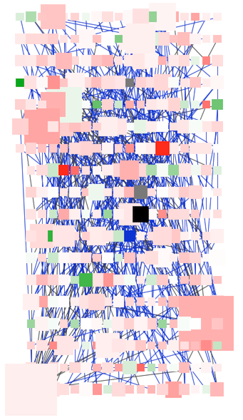

Rendering Engine
================

What is Level of Detail (LOD)?
------------------------------

Cytoscape 3.0 retains the rendering engine found in version 2.8. It is
to be able to display large networks (&gt;10,000 nodes), yet retain
interactive speed. To accomplish this goal, a technique involving
**level of detail (LOD)** is being used. Based on the number of objects
(nodes and edges) being rendered, an appropriate **level of detail** is
chosen. For example, by default, node labels (if present) are only
rendered when less than 200 nodes are visible because drawing text is a
relatively expensive operation. This can create some unusual behavior.
If the screen currently contains 198 nodes, node labels will be
displayed. If you pan across the network, such that now 201 nodes are
displayed, the node labels will disappear. As another example, if the
sum of rendered edges and rendered nodes is greater than or equal to a
default value of 4000, a very coarse level of detail is chosen, where
edges are always straight lines, nodes are always rectangles, and no
anti-aliasing is done. The default values used to determine these
thresholds can be changed by setting properties under **Edit ?
Preferences ? Properties...**.

**Low LOD vs High LOD**

  ------------------------------------------------------------------------------------------------------------------------------ --------------------------------------------------------------------------------------------------------------------------------
  Network with **Low** LOD                                                                                                       Network with **High** LOD
     
  ------------------------------------------------------------------------------------------------------------------------------ --------------------------------------------------------------------------------------------------------------------------------

With low LOD values, all nodes are displayed as square and anti-aliasing
is turned off. With high LOD values, anti-aliasing is turned on and
nodes are displayed as actual shape user specified in the Style.

### Parameters for Controlling LOD

**NOTE:** *The greater these thresholds become, the slower performance
will become.* If you work with small networks (a few hundred nodes),
this shouldn't be a problem, but for large networks it will produce
noticeable slowing. The various thresholds are described below.

  ------------------------------ ----------------------------------------------------------------------------------------------------------------------------------------------------------------------------------------------------------------------------------------------------------------------------------------------------------------
  render.coarseDetailThreshold   If the sum of *rendered* nodes and *rendered* edges equals to or exceeds this number, a very coarse level of detail will be chosen and all other detail parameters will be ignored. If the total number of nodes and edges is below this threshold, anti-alias will be turned on; this value defaults to 4000.
  render.nodeBorderThreshold     If the number of *rendered* nodes equals to or exceeds this number, node borders will not be rendered; this value defaults to 400.
  render.nodeLabelThreshold      If the number of *rendered* nodes equals to or exceeds this number, node labels will not be rendered; this value defaults to 200.
  render.edgeArrowThreshold      If the number of *rendered* edges equals to or exceeds this number, edge arrows will not be rendered; this value defaults to 600.
  render.edgeLabelThreshold      If the number of *rendered* edges equals to or exceeds this number, edge labels will not be rendered; this value defaults to 200.
  ------------------------------ ----------------------------------------------------------------------------------------------------------------------------------------------------------------------------------------------------------------------------------------------------------------------------------------------------------------

When printing networks or exporting to formats such as PostScript, the
highest level of detail is always chosen, regardless of what is
currently being displayed on the screen.

### Force to Display Detail

If you want to display every detail of the network regardless of LOD
values, you can toggle to full details mode by **View ? Show Graphics
Details (or CTR+SHIFT+F on Windows/Linux, Command+SHIFT+F for Mac)**.
This option forces the display of all graphics details. If the network
is large, this option slows down rendering speed. To hide details,
select the menu item again (**View ? Hide Graphics Details**).
